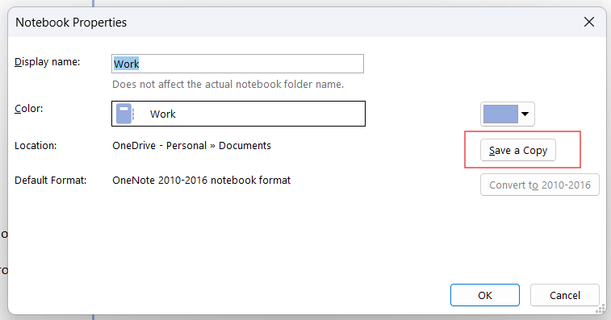

# Ingesting OneNote

KHB can ingest a whole OneNote notebook — every section, every page, in order, with tables,
lists, and the files people pasted into their notes. There is one wrinkle before it can, and
it is Microsoft's, not KHB's: **a modern OneNote notebook is not a file on your disk.**

This document covers getting a notebook onto disk, turning the reader on, declaring it as a
source, and what survives the trip.

## 1. Why an export step is needed at all

OneNote used to keep a notebook as a plain folder — one `.one` file per section — that
lived in your OneDrive folder and synced like any other file. OneNote for Microsoft 365 is
cloud-first: the notebook lives in the service, and what you see locally is a cache and a
stub, not a set of section files you can point a tool at. Ask OneDrive for the notebook's
folder and there is nothing readable there.

KHB only ingests bytes it can open (`AGENTS.md`, "division of labor"): it does not sign into
Microsoft accounts, hold tokens, or call the Graph API. So the notebook has to become files
first.

Fortunately OneNote still offers exactly that, and it is two clicks.

## 2. Save a copy

Right-click the notebook in OneNote's notebook list and choose **Properties**. The dialog
tells you where the notebook currently lives and what format it is in, and it carries the
button that matters:



**Save a Copy** writes the notebook out as ordinary files, in a folder you choose. Pick
somewhere stable and outside your hub — KHB reads sources in place and never wants a copy of
a corpus inside a bundle. What you get looks like this:

```
D:\onenote-export\Work\
├── Open Notebook.onetoc2        the notebook's table of contents
├── Quick Notes.one              one file per section
├── Projects.one
├── Meetings.one
└── Archive\                     a section group becomes a subfolder
    ├── Open Notebook.onetoc2
    └── 2024.one
```

A `.one` file is a **section** — one tab of the notebook — and it holds all of that
section's pages. That is the unit KHB reads.

Two notes from the same dialog:

- **Default Format** should read *OneNote 2010-2016 notebook format*. That is the format
  whose section files the reader understands. If the dialog instead offers a **Convert to
  2010-2016** button that is not greyed out, the notebook is in the older 2007 format;
  convert it first, then save the copy.
- If your OneNote version has no *Save a Copy* — some builds only offer
  **File → Export → Notebook** — you may get a `.onepkg` package instead. That is a single
  archive, not a folder, and KHB does not read it. Open it in OneNote once (which unpacks it
  into a normal notebook) and then save a copy, or unpack it and point KHB at the `.one`
  files inside.

## 3. Turn the reader on

Every other extractor KHB has is built in and needs no setup. OneNote is the exception,
because reading `.one` means parsing a proprietary binary store, and the one good open
implementation is a Python library. So this route needs Python plus one package.

### At hub creation

```bash
khb init ~/my-knowledge --with-onenote
```

The flag is opt-in, and it cannot break the command. KHB probes for a Python, checks that
`pip` is present, installs the package, and then **confirms the module actually imports** —
rather than trusting pip's exit code, because a reader that reports "ready" and cannot open
a `.one` is worse than an honest failure. On success:

```
OneNote: pyOneNote installed for python — .one sections will be read.
```

Every way this can go wrong ends with the hub created and the manual command printed: no
Python on `PATH`, no `pip` in that Python, a distro Python that refuses a global install
(it retries once with `--user`), or no network. Nothing else in KHB installs software on its
own initiative — an ingest that finds no reader pends those rows and tells you what to run.

### Later, by hand

`khb init` runs once per hub, so for a hub you already have — or if you skipped the flag —
install it yourself:

```bash
pip install -U https://github.com/DissectMalware/pyOneNote/archive/master.zip
```

The project has no maintained PyPI release; the archive above is what its own README
documents. `khb init` prints this same line at the end of a run when the reader is missing.

### Which Python, and how to check

KHB looks for `python`, `python3`, then `py`, and takes the first one that can
`import pyOneNote.OneDocument`. So install into a Python that is on your `PATH` — a
virtualenv works only while it is active in the shell you run `khb ingest` from.

Ask any time:

```bash
khb doctor        # or: khb status
```

```
Extraction
  bundled       text, PDF, DOCX, ODT, XLSX, PPTX, OCR (images + scanned PDFs), captions
  transcriber   vno (whisper.cpp)
  onenote       pyOneNote (python)
```

If it is missing, that line says which of the two problems you have — no Python at all, or a
Python without the package — because a `pip` command is advice a machine with no Python
cannot follow.

## 4. Declare the saved copy as a source

Point a bundle at the exported folder like any other folder source:

```yaml
sources:
  - type: folder
    path: D:\onenote-export\Work
    exclude:
      - "**/*.onetoc2"      # tables of contents: no page text in them
```

The `exclude` line is worth adding. A `.onetoc2` is the notebook's index, not content, and
KHB has no extractor for it — without the exclusion each one earns a ledger row with an
empty `raw` and a "no extractor for this format" reason, which is honest but noisy.

To ingest one section rather than a whole notebook, name it with a `files:` source instead:

```yaml
sources:
  - type: files
    paths:
      - D:\onenote-export\Work\Projects.one
```

## 5. Run it

```bash
khb ingest work
```

Each section announces itself before the work starts, and reports what it found:

```
  [3/12] D:\onenote-export\Work\Projects.one
         extracting OneNote section …
         reading with pyOneNote (python) …
         9 page(s), 12 embedded file(s), 2 unassigned
         extracted → raw/folder/Projects.one.md  [pyOneNote, quality: low]
         12 embedded file(s) → Projects.one.files/
  1/12 in Projects.one  D:\onenote-export\Work\Projects.one#diagram.png
         image — running OCR …
         extracted → raw/folder/Projects.one.files/diagram.png.md  [tesseract.js, quality: low]
```

### One section becomes one markdown file

```markdown
# Projects                     ← the section
## Kickoff notes               ← a page, in the order OneNote shows them
_Created: 2026-03-03 16:59:47_
…the page's text, lists and tables, in content order…

### Day two                    ← a subpage, nested by its own level
## Unassigned embedded files   ← files no current page claims
```

Pages become headings rather than separate files on purpose: deciding that *this page is a
concept* is judgement, and judgement belongs to the catalog pass, not to the CLI. What the
CLI owes that pass is a document whose seams are unmistakable, so "one concept per page" is
a mechanical read of the `##` headings. (Page text that would fake a seam — a pasted
Dockerfile's `# comment` — is escaped, so every heading in the file is a real page.)

### Embedded files become sources of their own

A notebook's real content is often *in* the attachments. So each embedded file is written
out beside the section's markdown, linked from the page it sits on, and then ingested as if
you had named it in `sources.yaml`:

```
raw/folder/Projects.one.md                          the section
raw/folder/Projects.one.files/spec.pdf              the payload, linked from above
raw/folder/Projects.one.files/spec.pdf.md           what KHB read out of it — quality: high
```

An attached PDF therefore goes through KHB's PDF reader, an attached spreadsheet comes out
as markdown tables, and an attached screenshot gets OCR'd — each with its **own `log.md`
row**, keyed `<section>#<name>`, and so its own place in the catalog backlog. `--skip-ocr`
means the same thing inside a notebook as outside one.

## 6. What survives, and what does not

Preserved: pages in section order; each page's **current** revision only; parent and subpage
titles kept apart; text in content order; tables as markdown tables; basic lists; creation
timestamps; every embedded file, written out and linked; an attachment that exists only in a
stored revision, labelled as such; and files with no current owner, listed at the end with
no owner invented for them.

Not preserved: **ink strokes** (handwriting is not recoverable at all), freeform page
positioning — OneNote pages are 2D canvases, and reading order here follows the content tree
rather than the visual layout — and styling such as bold or highlight.

That is why a section's markdown carries **`quality: low`** even though its words are real
text rather than a machine's guess: a page that was mostly handwriting or a screenshot can
arrive thin. When a page matters and reads wrong, open the section in OneNote. The escape
hatch for a page worth real fidelity is to export *that page* from OneNote as PDF or DOCX
and ingest it — KHB reads both at `quality: high`, structure included.

## 7. Refreshing later

Save a copy again, over the same folder, and re-run the ingest. KHB keys everything on
content hashes, so unchanged sections are skipped whole — nothing is re-parsed, no raw file
is rewritten, and nothing that was already cataloged returns to the backlog. Use
`khb ingest <bundle> --force` to re-read and re-unpack regardless.

## 8. Troubleshooting

| What you see | What it means |
|---|---|
| `no python on PATH — OneNote sections need python 3 and then: pip install …` | No Python was found. Install Python 3, then the package. The run continues and everything else ingests. |
| `pyOneNote is not installed (python has no pyOneNote) — run: pip install …` | Python is there, the package is not. |
| `pyOneNote could not parse it: <error>` | The reader is a forensic parser, not a renderer, and it gives up on some property types. The row pends with what it said; export that section's pages from OneNote as PDF or DOCX and ingest those instead. |
| `not a OneNote section store (file signature does not match)` | The file is named `.one` but is not a section store — often a stray or truncated file, or an older format. |
| `no extractor for this format` on a `.onetoc2` | Expected: that is the notebook's table of contents. Add `"**/*.onetoc2"` to the source's `exclude`. |
| `no pages recovered — the section may hold only ink` | The section parsed, but there was no text in it. Handwriting is not recoverable. |
| Counts in the run line (`… 2 unassigned`, `… 3 unresolved reference(s)`) | Reported deliberately: a partial extraction that reads as complete is the one failure this route could otherwise hide. |

## Credit

The `.one` parsing here rests entirely on **[pyOneNote](https://github.com/DissectMalware/pyOneNote)**
by Amirreza Niakanlahiji ([@DissectMalware](https://github.com/DissectMalware)), Apache
License 2.0 — a library written to let analysts pull information out of OneNote files. KHB
drives it from `pyscripts/onenote.py`, which walks the file's revision structure and page
tree and emits JSON; KHB turns that into markdown. Without pyOneNote's implementation of
the file format, none of this route would exist.

Its own reader is also the thing to reach for if you want to inspect a section by hand:

```bash
python -m pyOneNote.Main -f "D:\onenote-export\Work\Projects.one" -o .\dump
```

## See also

- `skills/ingest/SKILL.md` — the full ingest protocol, including the format table and the
  provenance header every `raw/` file carries
- [FAQ](faq.md) — the workflow stages and where judgement enters
- [SPEC.md](../SPEC.md) §6 — extraction, quality levels, and the caching model
